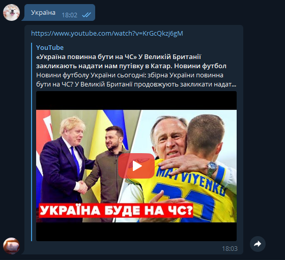
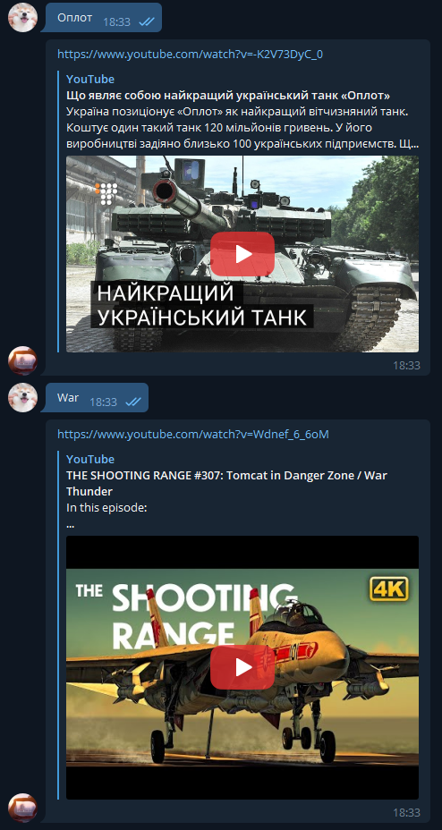
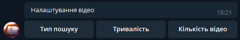
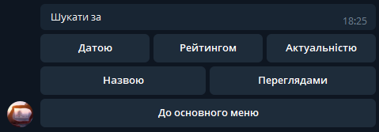
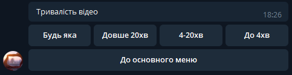
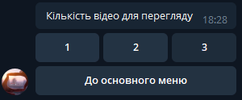

# TelegramBot
Цей телеграм бот створений для полегшення пошуку коротких відео для перегляду за їжею.
Доволі простий у використанні, потрібно лише ввести тег чи частину назви відео
# 
  

---
# Налаштування пошуку відео
Присутні також налаштування для пошуку бажаного відео.

- 1.Тип пошуку:
  - За датою
  - Рейтингом
  - Актуальністю
  - Назвою
  - Кількістю переглядів
  

- 2.Тривалість
  - Будь-яка
  - Довгі відео. Більше 20 хвилин
  - Стандартні відео. Від 4 до 20 хвилин
  - Короткі відео. До 4 хвилин

- 3.Кількість відео для видачі в чат 
  - Можна обрати від 1 до 3 відео 
  
 
